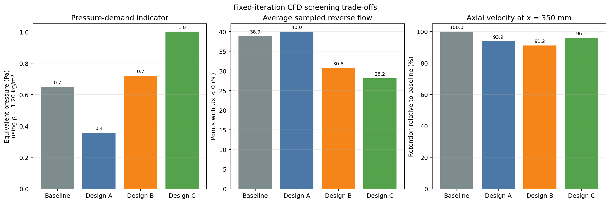

# PC Fan Airflow Guide

A measured 120 mm intake-fan project comparing three internal airflow guides. The repository contains parametric CAD, printable STEP/STL exports, archived OpenFOAM samples and logs, and scripts that recalculate every published table and figure.

The goal is narrow: determine which concepts are worth printing and testing. The CFD does **not** prove lower CPU or GPU temperatures.



## Current result

The first CFD pass narrows the physical test to two guides:

- **Design A** is the low-risk control. It has the lowest pressure-demand indicator and the simplest straight-vane geometry.
- **Design C** is the directional candidate. It has the lowest sampled reverse-flow fraction and retains the most downstream axial velocity among the guide designs, but it also has the highest pressure demand and a large transverse-velocity component.
- **Design B** is retained as an aggressive comparison, but its higher blockage and weaker downstream axial result make it a lower printing priority.

No design is declared final. The next decision requires a baseline-versus-A-versus-C physical test.

| Case | Printable blockage estimate | Pressure-demand indicator* | Mean reverse-flow samples | Axial velocity at 350 mm |
|---|---:|---:|---:|---:|
| Baseline | 0.00% | 0.65 Pa | 38.9% | 100.0% |
| Design A | 3.95% | 0.36 Pa | 40.0% | 93.9% |
| Design B | 7.02% | 0.72 Pa | 30.8% | 91.2% |
| Design C | 3.56% | 1.00 Pa | 28.2% | 96.1% |

\* OpenFOAM stores kinematic pressure for this incompressible setup. The table converts the sampled pressure difference using an assumed air density of 1.20 kg/m³. Treat it as a comparison indicator, not a fan-pressure measurement.

The full calculation is in [`results/cfd_summary.csv`](results/cfd_summary.csv). The archived runs ended at 200 iterations and were not convergence- or mesh-independence-certified; that limitation is carried into the decision instead of being hidden.

## Designs

| Design | Depth | Vanes | Bias | Vane thickness | Intended role |
|---|---:|---:|---:|---:|---|
| A — low blockage | 20 mm | 6 | 0° | 1.50 mm | Straight-vane, low-pressure candidate |
| B — angled guide | 25 mm | 8 | 14° | 2.00 mm | High-blockage comparison |
| C — balanced revision | 22 mm | 6 | 9° | 1.35 mm | Directional prototype candidate |

All three printable exports are single connected solids, watertight, manifold, and confined to their declared depth. The vanes overlap both the central hub and outer frame so they do not float as separate bodies.

## Rebuild and check

Requirements:

- Node.js 20 or newer for CAD export
- Python 3.10 or newer for analysis

```bash
npm install
python -m pip install -r requirements.txt
npm run check
```

Individual commands:

```bash
npm run cad
npm run analysis
npm run validate
```

The validation step checks STL envelopes and topology, recalculates key CFD values from the raw samples, checks local document links, and scans the public tree for private workspace residue.

## Repository map

- [`cad_designs/`](cad_designs/) — printable STEP/STL files and a dimensional fan reference
- [`scripts/generate_cad.cjs`](scripts/generate_cad.cjs) — parametric CAD source
- [`data/`](data/) — archived OpenFOAM target-plane samples and run logs
- [`scripts/analyze_openfoam_samples.py`](scripts/analyze_openfoam_samples.py) — table and figure generation
- [`results/`](results/) — corrected summaries, mesh checks, residuals, and figures
- [`docs/measurements.md`](docs/measurements.md) — measured fan and case constraints
- [`docs/cfd_method.md`](docs/cfd_method.md) — numerical method, provenance, and limitations
- [`docs/physical_test_plan.md`](docs/physical_test_plan.md) — repeatable prototype test procedure
- [`docs/sources.md`](docs/sources.md) — technical references

## Safety and scope

Power the PC down before installation. Confirm blade clearance by hand, secure the guide mechanically, and stop testing if the guide shifts, touches the rotor, or causes abnormal vibration or temperature.

This is an airflow-screening and prototyping project. It is not a certified thermal product or a universal fit for every 120 mm fan.

## License

Released under the [MIT License](LICENSE).
